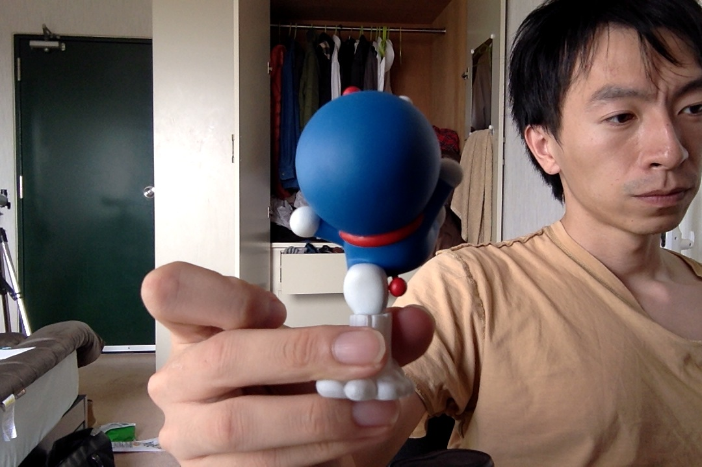



hello

<h1>这是一个游戏机的世界</h1>
<h2>这是一个中古游戏机的世界</h2>
<h3>这是中古的世界</h3>

<body style="background-color:yellow;">
<h2 style="background-color:red;">This is a heading</h2>

This is a paragraph.

<form action="">
<input type="button" value="Hello world!">
</form>

</body>

